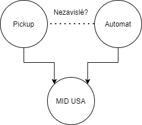
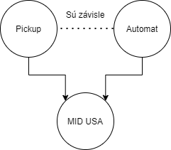

## Inicializácia

Načítanie knižníc

```{r echo=FALSE}
library(data.table)
library(funModeling)
library(ggplot2)
library(Hmisc)
library(tidyverse)
library(dplyr)
library(stringr)
library(bnlearn)
```

Načítanie dát

```{r}
data <- read.csv(file = 'data/vehicles.csv', header = TRUE)
data = subset(data, select = -1)
```


```{r}
data[2193,]
```
## Prieskumná analýza

V tejto časti si prejdeme a popíšeme dataset. Bližšie sa pozrieme akých sú hodnôt a čo popisujú.   

```{r}
c('number of columns:', ncol(data))
c('number of rows',nrow(data))
```

K dispozícii máme necelých 460 tisíc záznamov.  Pozrime sa na počet záznamov v datasete, ktoré obsahujú nejakú chýbajúcu hodnotu atribútu.


```{r}
data1 <- na.omit(data) 
print(nrow(data) - nrow(data1))

```

Môžme si pozrieť malú vzorku chývajúcich dát:

```{r}
data_na <- data[rowSums(is.na(data)) > 0,]
data_na[1:5,]
```

### Popis atribútov

```{r}
names(data)
```

Atribútov máme celkovo 25. 

- *id* - unikátny identifikátor záznamu - `číselný 10 miestny údaj`
- *`url`* - celá cesta, odkiaľ sa inzerát na vozidlo stiahol - `url`/`string`
- *region* - oblasť, z akého sa auto predáva - `string`
- *region_`url`* - cesta ku kategorii regionu na danom inzerčnom portáli - `url`/`string`
- *price* - kúplno/predajná cena vozdila - `číselný údaj`
- *year* - vyrobný rok vozdila - `číselný údaj`
- *manufacturer* - výrobca vozidla - `string`
- *model* - model vozdila - `string`
- *condition* - stav vozidla v akom sa vozdilo nachádza
- *cylinders* - počet valcov mootra daného vozidla
- *fuel* - typ paliva - `string`
- *odometer* - počet najazdených míľ  - `číselný údaj` 
- *title_status* - stav vozidla
- *transmission* - typ prevodovky vozidla - `string`
- *VIN* - (doplnkový údaj) identifikačné číslo vozdila
- *drive* - pohon vozidla - `string`
- *size* - označenie veľkosti vozidla napriklad full-size - `string`
- *type* - karosárske vyhotovenie vozidla - sedan, kupé, suv - `string`
- *pain_color* - farba vozidla - `string`
- *image_`url`* - cesta k obrázku daného vozidla - `url`/`string`
- *description* - popis vozidla
- *state* - oblasť predaja vozidla
- *lat a long* - súradnice
- *posting_data* - dátum uverejnenia inzerátu


Nižšie máme menšiu ukážku dát a ich bližšiu špecifikáciu. 

```{r}
head(data,5)
```

### Deskriptívna štatistika 

```{r}
summary(data)
```

Ako významné atribúty, s ktorými budeme dalej pracovať, sme vybrali: 

- price
- year
- manufacturer
- model
- condition
- cylinders
- fuel
- odometer
- transmission
- vin
- drive
- size
- type
  
## Analýza atribútov

### Cena (price)
Pozrieme sa či v atribúte máme nejaké prázdné hodnoty:

```{r}
sum(is.na(data$price))
```

Pozrieme sa na vychýlené hodnoty v atribúte

```{r}

boxplot(data$price, las =2)

```

Vidíme, že v atribúte `price` máme zopár dosť vysokých hodnôt. Buď ide o luxusné autá, alebo o "špinavé" hodnoty.

```{r}
data[order(-data$price),][1:5,]
```

Ako sme sa mohli presvedčiť, o žiadne Ferarri ani Lamborghini nejde, sú to nesprávne vyplnené dáta.


```{r}
nrow(data[order(data$price) & data$price < 1,])
```

Čo nás však neteší je však, ako sme sa mohli presvedčiť aj fakť že dosť vela hodnôt (33 753) tohto atribútu je nulových. Domnievame sa, že ide o umelo znížené alebo nešpecifikované sumy, práve z dôvodu rankingu v rebríčkoch inzerátov.

Máme veľké množstvo inzerátov s cenou 0, táto praktika sa používa pokiaľ chcete mať inzeráty na prvých stránkach, pretože ludia bežne hľadajú od najnižšej ceny po svoj cenový strop. 

```{r}
nrow(data[data$price >= 1111111, ])
```

```{r}
data <- data[!data$price >= 1111111, ]
```

Rozhodli sme sa vychýlené hodnoty sme odstrániť, odstránili sme hodnoty nad 1 111 111 pretože vyzerajú ako náhodné čísla, nakoľko ide o veľmi malý zlomok dát (44).

```{r}
boxplot(data$price, las=2)
```

```{r}
ggplot(data = data, aes(sample=price)) +
  stat_qq() + 
  stat_qq_line() +
  scale_y_continuous(breaks = seq(0, 5000000, by = 50000)) 
```

Na ggplot-e máme možnosť vidieť že dáta ceny nepochádzajú z normálneho rozdelenia, a dátová sada je veľmi nafúknutá na koncoch ( veľký počet nulových a áut s vysokou cenou).

### Rok (year)

Počet prázdnych hodnôt:

```{r}
sum(is.na(data$year))
```
Ako možeme vidieť, atribút *rok* má 1050 prázdnych hodnôt. 

Jednou z možností ktorú sa domnievame je že v Amerike je bežné že sa autá prestavujú, je možné že predávajúci rok neudal z dôvodu, takejto prestavby, kde rok nehrá žiadnu rolu, napríklad: Karoséria vozidla je z roku 1970 a implementovaná technika z roku 2018. 

```{r}
data[is.na(data$year),][1:5,]
```

Ako môžeme vidieť, v atribúte description je častokrát uvádzaný aj rok daného automobilu, čiže prichádza du úvahy, že by sme mohli tento rok extrahovať namiesto týchto chýbajúcich hodnôt z tohto atribútu.

```{r}
ggplot(data = data[!is.na(data$year),], aes(sample=year)) +
  stat_qq() + 
  stat_qq_line() +
  scale_y_continuous(breaks = seq(1900, 2022, by = 10)) 
```
```{r}
ggplot(data = data[!is.na(data$year),], aes(x=year)) + 
  geom_histogram(bins = 121, fill= 6, color="#ffffff") +
  xlab("Rok") +
  ylab("Frekvencia") +
  scale_y_continuous(breaks = seq(0, 500000, by = 20000)) +
  scale_x_continuous(breaks = seq(1900, 2021, by = 5)) +
  theme(axis.text.x = element_text(angle = 90))
```

Môžme vidieť, že dáta rokov nepochádzajú z normálneho rozdelenia. Starších vozidiel (pod 1990) aj novších máme nedostatok, naopak - čo sa dalo aj očakávať, vozidiel z posledných troch dekád je najviac. Nájdu sa tu aj vozidlá staršie, ale tie sa prevažne inzerujäú na špecializovaných fórach, napríklad pre veterány. 

Toto rozdelenie sa dalo predpokladať, kedže [priemerný vek vozidla je 12 rokov](https://www.caranddriver.com/news/a33457915/average-age-vehicles-on-road-12-years/).

### Výrobca (manufacturer)

Počet prázdnych hodnôt.

```{r}
sum(is.na(data$manufacturer))
```

Prázdne hodnoty "na" nemáme, ale obsahuje prázdne `string`y celkovo až 18 tisíc záznamov má zle vyplnený inzerát, alebo sa dáta stratili pri exportoch.

```{r}
nrow(data[data$manufacturer == "",])
```

Skúsime si vytvoriť histogram podľa frekvencie daných výrobcov:

```{r}
group_manu <- data %>%
  group_by(manufacturer) %>%
  summarize(frequency = n())

group_manu$manufacturer[which(group_manu$manufacturer == "")] <- NA

group_manu[order(-group_manu$frequency),][1:10,]
```

Vidíme že Amerika nesklamala, a rebríčku kraľuje domáci výrobca - `Ford`.

```{r}
ggplot(data = group_manu, aes(x = manufacturer, y = frequency)) +
  geom_bar( stat = "identity", fill= 2, color="#ffffff") +
  ylab("Frekvencia") +
  xlab("Výrobca")  +
  theme(axis.text.x = element_text(angle = 90)) +
  scale_y_continuous(breaks = seq(0, 100000, by = 5000)) 
```

### Model (Model)

Počet prázdnych hodnôt:

```{r}
sum(is.na(data$model))
```
Prázdne hodnoty `na` nemáme, ale obsahuje prázdne `string`y.

```{r}
nrow(data[data$model == "",])
```

Máme približne 5 tisíc záznamov, ktoré nemajú vyplnený stĺpec model. V nasledujúcej tabuľke síce vidíme že niektoré z dát obsahujú názvy modelov v popise inzerátu (`description`).

```{r}
data[data$model == "",][1:5,]
```

```{r}
group_model <- data %>%
  group_by(model) %>%
  summarize(frequency = n())

group_model$model[which(group_model$model == "")] <- NA

group_model[order(-group_model$frequency),][1:10,]
```

### Stav (condition)

```{r}
nrow(data[data$condition == "",])
```

Stĺpec stavu vozdila nemá vyplnený skoro polovica inzerátov na craigliste *ヽ(°〇°)ﾉ*.
To bude docela prúser, nakoľko sme aj na základe tohto atribútu chceli určovať trendy cien vozidiel.

```{r}
length(unique(data$condition))
```

```{r}
unique(data$condition)
```
Ide iba o rýchlu informáciu v akom stave auto je, pokiaľ prechádzame inzeráty.

```{r}
group_cond <- data %>%
  group_by(condition) %>%
  summarize(frequency = n())

group_cond$condition[group_cond$condition ==""] <- NA

ggplot(data = group_cond, aes(x = condition, y = frequency)) +
  geom_bar( stat = "identity", fill= 2, color="#ffffff") +
  ylab("Frekvencia") +
  xlab("Condition")
```

### Počet valcov (cylinders)

```{r}
nrow(data[is.na(data$cylinders),])
```

```{r}
nrow(data[data$cylinders == "",])
```
Vidíme že skoro štvrtina záznamov obsahuje prázdny `string` v atribúte vyjadrujúcom počet valcov.

```{r}
length(unique(data$cylinders))
```
```{r}
unique(data$cylinders)
```


```{r}
group_cyl <- data %>%
  group_by(cylinders) %>%
  summarize(frequency = n())

ggplot(data = group_cyl, aes(x = cylinders, y = frequency)) +
  geom_bar( stat = "identity", fill= 2, color="#ffffff") +
  ylab("Frekvencia") +
  xlab("Počet valcov")
```
### Typ paliva (fuel)

```{r}
nrow(data[is.na(data$fuel),])
```

```{r}
nrow(data[data$fuel == "",])
```
Vidíme, že 3237 áut jazdí zadarmo. *(✧ω✧)*

```{r}
length(unique(data$fuel))
```

```{r}
unique(data$fuel)
```


```{r}
group_fuel <- data %>%
  group_by(fuel) %>%
  summarize(frequency = n())

ggplot(data = group_fuel, aes(x = fuel, y = frequency)) +
  geom_bar( stat = "identity", fill= 2, color="#ffffff") +
  ylab("Frekvencia") +
  xlab("Palivo")+
  scale_y_continuous(breaks = seq(0, 500000, by = 20000)) 
```
Z histogramu vidíme, že väčšina áut ktoré sú inzerované su benzínové. 

### Počet kilometrov (odometer)

```{r}

nrow(data[is.na(data$odometer),])
```

```{r}
nrow(data[data$odometer == "",])
```
```{r}
boxplot(data$odometer, las=2)
```

```{r}
data[order(-data$odometer),][1:10,]
```

```{r}
data_gt_mil_odo <- data[!is.na(data$odometer) & data$odometer > 1000000,]
nrow(data_gt_mil_odo[order(-data_gt_mil_odo$odometer),])
```

Vidíme, že približne 400 záznamov má príliš vysoké hodnoty - máme za domienku, že sú to vymyslené dáta.

```{r}

options(scipen=10)
boxplot(data[data$odometer < 1000000,] $odometer, las=2)
```
Vidíme že po subsetovaní atribútu pod 1 milión míl sme dospeli k realistickejším dátam. Vidíme že väčšina hodnôt sa pohybuje v rozpätí od cca 45 000 až po 150 000. Medián sa pohybuje niečo pod 100k.

### Typ prevodovky (transmission)

```{r}
nrow(data[is.na(data$transmission),])
```

```{r}
nrow(data[data$transmission == "",])
```

```{r}
length(unique(data$transmission))
```
```{r}
unique(data$transmission)
```
Vidíme že ide o kategorický atribút vyjadrujúci typ prevodovky.

```{r}
group_trans <- data %>%
  group_by(transmission) %>%
  summarize(frequency = n())

ggplot(data = group_trans, aes(x = transmission, y = frequency)) +
  geom_bar( stat = "identity", fill= 2, color="#ffffff") +
  ylab("Frekvencia") +
  xlab("Prevodovka")+
  scale_y_continuous(breaks = seq(0, 500000, by = 20000)) 
```
Vidíme že sa potvrdzuje fakt, že Američania nevedia riadiť manuál a že najlepším bezpečnostným systémom áut je manuálna prevodovka. 

> What is that stick?


### vin (vin)

```{r}
nrow(data[is.na(data$VIN),])
```

```{r}
nrow(data[data$VIN == "",])
```


### pohon (drive)


```{r}
nrow(data[is.na(data$drive),])
```

```{r}
nrow(data[data$drive == "",])
```

```{r}
length(unique(data$drive))
```

```{r}
unique(data$drive)
```

```{r}
group_drv <- data %>%
  group_by(drive) %>%
  summarize(frequency = n())

ggplot(data = group_drv, aes(x = drive, y = frequency)) +
  geom_bar( stat = "identity", fill= 2, color="#ffffff") +
  ylab("Frekvencia") +
  xlab("Pohon")+
  scale_y_continuous(breaks = seq(0, 500000, by = 20000)) 
```
Vidíme že väčšina z predávaných je poháňaná náhonom na všetky štyri kolesá. Veľkou skupinou dát sú aj dáta s neuvedenou hodnootu tohto atribútu.

### veľkosť (size)

```{r}
nrow(data[is.na(data$size),])
```

```{r}
nrow(data[data$size == "",])
```
--
```{r}
length(unique(data$size))
```

```{r}
unique(data$size)
```

```{r}
group_size <- data %>%
  group_by(size) %>%
  summarize(frequency = n())

ggplot(data = group_size, aes(x = size, y = frequency)) +
  geom_bar( stat = "identity", fill= 2, color="#ffffff") +
  ylab("Frekvencia") +
  xlab("Velkosť")+
  scale_y_continuous(breaks = seq(0, 500000, by = 20000)) 
```

### karosárske prevedenie (type)

```{r}
nrow(data[is.na(data$type),])
```

```{r}
nrow(data[data$type == "",])
```

```{r}
length(unique(data$type))
```
```{r}
unique(data$type)
```


```{r}
group_type <- data %>%
  group_by(type) %>%
  summarize(frequency = n())

ggplot(data = group_type, aes(x = type, y = frequency)) +
  geom_bar( stat = "identity", fill= 2, color="#ffffff") +
  ylab("Frekvencia") +
  xlab("Typ")+
  scale_y_continuous(breaks = seq(0, 500000, by = 20000)) +
  theme(axis.text.x = element_text(angle = 90))
```
## Párová analýza


### Kategorické atribúty 

### Vplyv typu paliva na počet najazdených míľ

```{r}
ggplot(data, aes(x = fuel, y = odometer)) + ylim(10,500000) + geom_boxplot()
```
Podľa boxplotu máme možnosť vidieť, že pri dieslových motoroch sa autá predávajú s vyšíím počtom najazdených míľ.
Čo nás prekvapilo, je napríklad pomer hybridných a benzínových (gas) motorov. Domnievame sa však, že veľa dát je taktiež ešte nezatriedených v dátach s prázdnym atribútom `fuel`.

```{r}
ggplot(data, aes(x = drive, y = odometer)) + ylim(10,500000) + geom_boxplot()
```


```{r}
ggplot(data, aes(x = transmission, y = odometer)) + ylim(10,500000) + geom_boxplot()

```

```{r}
ggplot(data, aes(x = fuel, y = price)) + ylim(10,300000) + geom_boxplot()
```

```{r}
ggplot(data, aes(x = drive, y = price)) + ylim(10,300000) + geom_boxplot()
```

```{r}
ggplot(data, aes(x = transmission, y = price)) + ylim(10,300000) + geom_boxplot()
```

```{r}
ggplot(data, aes(x=transmission, y=odometer, color=fuel)) + 
  ylim(10,500000) +
  geom_point(size=6) +
  theme_bw()
```

```{r}
ggplot(data = data, aes(x = transmission,y = price, shape = drive, colour= fuel)) + ylim(10,300000) + geom_jitter(size = 4) +  xlab("Prevodovka")
```

```{r}
pairs(~price+odometer+year, data = data)
```


###Zhrnutie problémov

V datasete sme identifikovali viacero problémov, medzi ne patria: 

1. Vychýlené hodnoty (outliers)
1. Zle vyplnené polia
1. Prázdne hodnoty

####Vychýlené hodnoty

Do tejto kategórie spadájú kvantitatívne atribúty ako sú odometer, cena a rok.
Pri odometri máme viacerých outlierov, ktorí nám pripadajú, že sú ich hodnoty buď vymyslené alebo vznikli chybou vyplnenia. Pri cene to je také isté, niektoré modely majú prevýšenú cenu niekoľko krát, veľa inzerátov má zase nulovú cenu. Problémom pri týchto dátach ktoré máme je, že nie je jednoduché tieto dáta doplniť alebo ich nahradiť. Jednotlivé inzeráty by bolo potrebné rozdeliť podla značky, následne podľa modelu, roku, najazdených kilometrov atď., pretože cena závisí od týchto parametrov. Takýmto krokom by sme si mohli aj sami zaviesť nepresnosti do dát, čím by mohli byť skreslené. Preto sa z našeho pohľadu neoplatí vkladať značný effort na doplnenie týchto dát a radšej dané záznamy vymažeme.

####Zle vyplnené polia

Viaceré atribúty ako sú model, výrobca, prevodovka majú prázdne hodnoty. Buď je to zle vyplnené užívateľom, alebo crawler ktorý dáta sťahoval mal implementačnú chybu. Niektoré atribúty by bolo možné opraviť, ale bolo by potrebné špecifické dáta, ktoré sme k dispozícii nenašli. Ide o to, že nie každý model ma všetky dostupné konfigurácie. Niektoré modely nemusia mať manuálne prevodovky pokiaľ majú pohon predných kolies a podobne. Preto bude najjednoduchšie tieto záznamy odstrániť. 

####Prázdne hodnoty

Prázdne hodnoty sme detekovali skoro v každom atribúte. Pri niektorých atribútoch nemáme možnosť ako ich doplniť - model, výrobca, palivo atď, pretože nepoznáme konfiguráciu vozidla. Pri niektorých to ani nemá význam, pretože ich majitľl nezadal a nevieme odhadnúť skutočný popis vozidla - stav, typ karosérie, vin číslo. Preto tieto hodnoty budeme brať ako plus a možno majú dôvod vyššej ceny.

Prevažne pri všetkých typoch problémov je pre nás najjednoduchšie odstrániť tieto záznamy. Pri atribútoch, ktoré nie sú vyplnené z dôvodu toho, že majiteľ ich nezadal, budeme k nim pristupovať ako k možnej príčine vyššej ceny. Niektoré prázdne alebo nedefinované hodnoty môžeme rozdeliť medzi ostatné atribúty, čím rozloženie ostane zostane rovnaké - napríklad typ prevodovky.


### Hypotézy

1. Cena vozidla je vyššia v prípade že v inzeráte je definované VIN číslo.
1. Trend počtu valcov v autách klesá spolu s rastúcim rokom (Môže za to downsizing motorov a snaha o odbremenenie životného prostredia)
1. Dieslové autá ktoré majú pohon na všetky kolesá zvyčajne majú v inzerátoch vyšší počet najazdených míľ.
1. Rozdeliť oblasť inzerátov na 3 časti východná, stredná a západná časť USA podľa súradníc a odsledovať, aké je rozdelenie využívaných aut a či je v strednej časti viac využívaných pickupov ako iných modelov.

Budeme postupovať metódou hypothesis-driven. Budeme sa snažiť overiť naše stanovené hypotézy a overiť ich pravdivosť a v závere zhodnotiť. 

##Čistenie dát

###Duplikáty

```{r}
nrow(data)
```

```{r}
nrow(unique(data))
```

Ako môžeme vidieť v našich dátach sa nenachádzajú duplikáty, teda nemáme prácu s ich odstránením. 

###Odstránenie prázdnych hodnôt

Ako sme spomínali skôr nie je možné dopĺňať stávajúce dáta, pretože prepojenosť dát je príliš veľká na to aby sme mohli jednotlivé záznamy dopĺnať. Mohli by vzniknúť kombinácie záznamov ktoré ani reálne neeexistujú. Preto je pre nás prínosnejšie tieto záznamy odstrániť, než si vedome vnášať vysoký bias do dát.

#### Model

Ako sme spomínali v analýze, vhodným spôsobom na vyplnenie chýbajúcich hodnôt modelu by bol positive lookahead v atribúte `description`. V skratke, v popise inzerátu vezmeme prvé slovo po výrobcovi. Čiže ak výrobcu máme "Mazda" a model je NA, a v prípade, že v `description` je "Mazda 6", tak do modelu vložíme "6".

```{r}
data[data$model == "",]$model <- NA
nrow(data[is.na(data$model),])
```

```{r}
data[is.na(data$model),]$model <- apply(data[is.na(data$model),], MARGIN=1, FUN=function(row) {
  model <- str_extract(row['description'], regex(sprintf("(?<=%s\\s)\\w+", row['manufacturer']),ignore_case=TRUE))
  return(model)
})
```

```{r}
nrow(data[is.na(data$model),])
```
```{r}
data[is.na(data$model),][1:5,]
```

Náhradu považujeme za úspešnú, dokázali sme takto nahradiť vyše polovicu chýbajúcich hodnôt. Takýto spôsob síce nie je 100-percentný, ale aspoň niečo.
Nie vždy sa názov modelu nachádza za názvom výrobcu. Spôsob ktorým by sme toto teoreticky mohli riešiť je vytvorenie histogramu modelov, a určenie thresholdu (hranice) a nahradenie modelov, ktoré budeme považovať ako outlierov naspäť za NA.
Napríklad, v prípade že nejaký model je vo všetkých inzerátoch len 1 alebo 2x, je vysoká pravedepodobnosť že ide o chybu.


#### Manufacturer

Teoreticky by sa tento atribút dal vyplniť opäť pomocou regexu z `description`, pokiaľ by sme mali ďalší dataset, zoznam všetkých výrobcov vozidiel, ale rozhodli sme sa tieto chýbajúce riadky odstrániť.

```{r}
nrow(data[data$manufacturer == '',])
data <- data[!data$manufacturer == '',]
```


#### Condition, cylinders, fuel, transmission, drive, size, type,odometer, year,long

Tieto atribúty sú dôležité pre naše hypotézy ohľadom ceny vozidla, nedal by sa nahradiť nijakým spôsobom (priemer, rozdelenie so zachovaním distribúcie a iné), čo by nám poškodilo autenticitu dát, preto sme sa ich rozhodliť odstrániť.

```{r}
for (attribute in c('condition','cylinders','fuel','transmission','drive','size','type','odometer','year','long')) {
  data <- data[!data[attribute] == "",]
  data = data[!is.na(data[attribute]), ]
}

```

VIN číslo odstraňovať nebudeme, pri tomto atribúte chceme zistiť, či má inzerát vyššiu cenu pokiaľ tento atribút existuje. 


### Vysporiadanie sa s vychýlenými hodnotami. Tento problém máme pri atribútoch ceny a odometra.

```{r}
percentil <- function(x){
    quantiles <- quantile( x, c(.05, .95 ) )
    x[ x < quantiles[1] ] <- quantiles[1]
    x[ x > quantiles[2] ] <- quantiles[2]
    x
}
```

#### Price

Pri cene sme sa stretli s tým, že veľké množstvo inzerátov uvádza nulu pri cene. Bude to z dôvodu lepšej viditeľnosti, kedže ľudia väčšinou zoraduju produkty podla ceny. Pri týchto vozidlách nevieme zistiť reálnu cenu.

```{r}
data <- data[!data$price <= 500, ]
```

```{r}
boxplot(data$price, las=2)
```
```{r}
ggplot(data = data, aes(sample=price)) +
  stat_qq() + 
  stat_qq_line() +
  scale_y_continuous(breaks = seq(0, 5000000, by = 50000)) 
```

```{r}
data$price = percentil(data$price)
```

```{r}
boxplot(data$price, las=2)
```
```{r}
ggplot(data = data, aes(sample=price)) +
  stat_qq() + 
  stat_qq_line() +
  scale_y_continuous(breaks = seq(0, 5000000, by = 50000)) 
```

Zarovnaný koniec a začiatok ukazuje o tom ako 95 a 5 percentil funguje. Vychýlené hodnoty sme prevažne odstránili, čím distribúcia dát je lepšia ale stále dáta nepochádzajú z normálneho rozdelenia.

#### Odometer

```{r}
boxplot(data$odometer, las=2)
```

```{r}
ggplot(data = data, aes(sample=odometer)) +
  stat_qq() + 
  stat_qq_line() +
  scale_y_continuous(breaks = seq(0, 1000000, by = 250000)) 
```

```{r}
data <- data[!data$odometer > 1000000, ]
```

Pouziť percentil alebo nepoužiť percentil ?? 

```{r}
data$odometer = percentil(data$odometer)
```

```{r}
boxplot(data$odometer, las=2)
```

```{r}
ggplot(data = data, aes(sample=odometer)) +
  stat_qq() + 
  stat_qq_line() +
  scale_y_continuous(breaks = seq(0, 5000000, by = 50000)) 
```

Väčšinu problémov ktoré sme mali sme vyriešili vymazaním týchto záznamov, alebo ich úpravou pomocou quartilov. 

#### mid, west, east USA

Príprava dáta pre 4. hypotézu - podľa zemepisnej dĺžky rozdelíme inzeráty na východ, stred a západ USA. 
Hodnoty zemepisnej dĺžky sme približne určili podľa tejto mapy:


```{r}
data$location <- ifelse(as.double(data$long) > -85, 'east', 
  ifelse(as.double(data$long) < -110, 'west', 'mid')
)
```

## Overenie hypotéz

### Cena vozidla je vyššia v prípade že v inzeráte je definované VIN číslo.

```{r}
data$VIN_defined = apply(data, MARGIN=1, FUN=function(x) x['VIN'] != '')

model <- lm(data$price ~ data$VIN_defined)
summary(model)

#t.test(price ~ VIN_defined, data=data)
```
```{r}
ggplot(data, aes(x=VIN_defined,y=price)) + geom_boxplot()
```


### Trend počtu valcov v autách klesá spolu s rastúcim rokom (Môže za to downsizing motorov a snaha o odbremenenie životného prostredia)

```{r}
ggplot(data, aes(year, cylinders )) + 
  geom_point() + 
  geom_line()
```

### Dieslové autá ktoré majú pohon na všetky kolesá zvyčajne majú v inzerátoch vyšší počet najazdených míľ.

```{r}
data$awd_diesel <- apply(data, MARGIN=1, FUN=function(x) x['drive'] == '4wd' & x['fuel'] == 'diesel')
ggplot(data, aes(x=awd_diesel,y=odometer)) + geom_boxplot()
```

### Rozdeliť oblasť inzerátov na 3 časti východná, stredná a západná časť USA podľa súradníc a odsledovať, aké je rozdelenie využívaných aut a či je v strednej časti viac využívaných pickupov ako iných modelov.

```{r}
group_type_east <- data[data$location == 'east',] %>%
  group_by(type) %>%
  summarize(frequency = n())

ggplot(data = group_type_east, aes(x = type, y = frequency)) + geom_bar( stat = "identity")
```

```{r}
group_type_west <- data[data$location == 'west',] %>%
  group_by(type) %>%
  summarize(frequency = n())

ggplot(data = group_type_west, aes(x = type, y = frequency)) + geom_bar( stat = "identity")
```

```{r}
group_type_mid <- data[data$location == 'mid',] %>%
  group_by(type) %>%
  summarize(frequency = n())

ggplot(data = group_type_mid, aes(x = type, y = frequency)) + geom_bar( stat = "identity")
```

## Bayes
Je jav, že inzerované auto má automat nezávislý od toho či je inzerované auto pickup ? 

Pravdepodobnosť, že auto ma automat:
```{r}
print(nrow(data[data$transmission == "automatic", ])/nrow(data))
PA = nrow(data[data$transmission == "automatic", ])/nrow(data)
```
Pravdepodobnosť, že auto je pickup:
```{r}
print(nrow(data[data$type == "pickup", ])/nrow(data))
PP = nrow(data[data$type == "pickup", ])/nrow(data)
```

Pravdepodobnosti stavov P(M=1|P,A)
MID = 1 PICKUP = 1 AUTOMAT = 1
```{r}
data_pick = data[data$type == "pickup", ]
data_pick_automat = data_pick[data_pick$transmission == "automatic", ]
data_pick_automat_mid =data_pick_automat[data_pick_automat$location == "mid", ]
Pm1p1a1 = nrow(data_pick_automat_mid) / nrow(data_pick_automat)
print(nrow(data_pick_automat_mid) / nrow(data_pick_automat))
```
MID = 1 PICKUP = 1 AUTOMAT = 0
```{r}
data_pick = data[data$type == "pickup", ]
data_pick_automat = data_pick[!data_pick$transmission == "automatic", ]
data_pick_automat_mid =data_pick_automat[data_pick_automat$location == "mid", ]
Pm1p1a0 = nrow(data_pick_automat_mid) / nrow(data_pick_automat)
print(nrow(data_pick_automat_mid) / nrow(data_pick_automat))
```
MID = 1 PICKUP = 0 AUTOMAT = 1
```{r}
data_pick = data[!data$type == "pickup", ]
data_pick_automat = data_pick[data_pick$transmission == "automatic", ]
data_pick_automat_mid =data_pick_automat[data_pick_automat$location == "mid", ]
Pm1p0a1 = nrow(data_pick_automat_mid) / nrow(data_pick_automat)
print(nrow(data_pick_automat_mid) / nrow(data_pick_automat))
```

MID = 1 PICKUP = 0 AUTOMAT = 0
```{r}
data_pick = data[!data$type == "pickup", ]
data_pick_automat = data_pick[!data_pick$transmission == "automatic", ]
data_pick_automat_mid =data_pick_automat[data_pick_automat$location == "mid", ]
Pm1p0a0 = nrow(data_pick_automat_mid) / nrow(data_pick_automat)
print(nrow(data_pick_automat_mid) / nrow(data_pick_automat))
```
Chceme overiť nezávislosť P a A. $\ P(P,A|M) (nevieme spočítať) = P(A|M) * P(P|M)$ - tento vzťah musí platiť pokial maju byť javy nezávislé.


$\ P(M=1|P,M) = sum_{P,A} P(M=1,P,A)*P(P)*P(A)$ 
```{r}
Pm1ap = Pm1p0a0*(1-PP)*(1-PA) + Pm1p0a1*(1-PP)*(PA) + Pm1p1a0*(PP)*(1-PA) + Pm1p1a1*(PP)*(PA)
Pm1ap
```

$\ P(P,A|M=1) = \frac{sum_{P,A} P(M=1,P,A)*P(P)*P(A)}{P(M=1|P,A)} $


$\ P(P=1,A=1|M=1) $
```{r}
Pp1a1m1 = Pm1p1a1*(PP)*(PA) / Pm1ap
Pp1a1m1
```
$\ P(P=0,A=1|M=1) $
```{r}
Pp0a1m1 = Pm1p0a1*(1-PP)*(PA) / Pm1ap
Pp0a1m1
```
$\P(P=1,A=0|M=1) $
```{r}
Pp1a0m1 = Pm1p1a0*(PP)*(1-PA) / Pm1ap
Pp1a0m1
```

$\P(P=0,A=0|M=1) $
```{r}
Pp0a0m1 = Pm1p0a0*(1-PP)*(1-PA) / Pm1ap
Pp0a0m1
```

Teraz sa pozrieme na druhú časť vzťahu $\ P(A|M) * P(P|M)$

1.$\ P(P=1|M=1) = \sum_{A} P(P=1,A|M=1)$
```{r}
Pp1m1 = Pp1a1m1 +  Pp1a0m1
Pp1m1
```

1.$\ P(A=1|M=1) = \sum_{P} P(P,A=1|M=1)$

```{r}
Pa1m1 = Pp1a1m1 + Pp0a1m1
Pa1m1
```

Ak by javy P a A boli nezávislé, tak musí pre všetky stavy platiť, že: $\ P(P=1,A=1|M=1) =P(P=1|M=1) * P(A=1|M=1)  $


```{r}
if(Pp1a1m1 == (Pp1m1*Pa1m1)){print('Nezavisle')}else print('zavisle')
```


